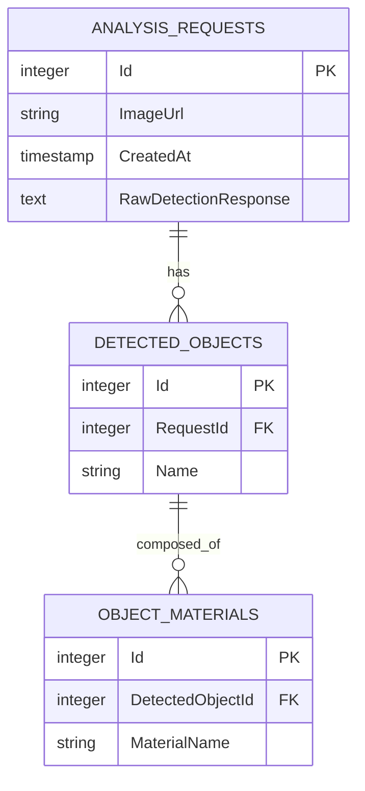

# Biogenom

---

## Оглавление

1. [Описание решения и архитектура](#описание-решения-и-архитектура)
2. [Схема базы данных (ER-диаграмма)](#схема-базы-данных-er-диаграмма)
3. [Промпты (Prompts)](#промпты-prompts)
4. [Порядок запуска](#порядок-запуска)
5. [Тестирование API](#тестирование-api)

---

## Описание решения и архитектура

Проект разработан без использования *Minimal API* и *Top-Level Statements* — это даёт строгую типизацию и чёткое разделение ответственности между слоями приложения.

Логика работы разделена на два этапа:

* **Первичный анализ (Object Detection)**

  * Система принимает URL изображения, загружает картинку и запрашивает у нейросети список физических объектов.
  * Ссылка на изображение и сырой ответ нейросети сохраняются в базе данных для последующей трассировки.

* **Глубокий анализ (Material Analysis)**

  * Пользователь подтверждает/редактирует список найденных объектов.
  * Сервер отправляет утверждённый список вместе с изображением в нейросеть для определения материалов каждого объекта.
  * Результат сохраняется в нормализованном виде (см. схему БД).

**Особенности интеграции с GigaChat:**

* Реализован обмен `AuthKey` → `AccessToken` для автоматической авторизации.
* Загрузка файлов реализована через `POST /api/v1/files` с `multipart/form-data` (передача Base64 в JSON для больших изображений часто вызывает 400 Bad Request).
* Для потокобезопасного обновления токена используется `SemaphoreSlim`.

---

## Схема базы данных (ER-диаграмма)

Схема нормализована (3NF) и реализована в PostgreSQL.



**Описание сущностей**

* `AnalysisRequests` — контекст запроса: `Id`, `ImageUrl`, `CreatedAt`, `RawDetectionResponse`.
* `DetectedObjects` — найденные предметы, привязанные к запросу (например, "стол").
* `ObjectMaterials` — материалы для каждого предмета (например, "дерево", "металл"). Один объект может иметь несколько материалов.

---

## Промпты (Prompts)

Для строгого формата ответов используются системные инструкции, требующие возврата только JSON.

**Промпт №1 — Определение предметов**

```text
Ты - эксперт по анализу изображений. Твоя задача - перечислить основные физические предметы на фото. Верни ТОЛЬКО JSON массив строк. Например: ["стол", "стул"]. Не пиши ничего кроме JSON.
```

**Промпт №2 — Определение материалов**

```text
На изображении присутствуют следующие предметы: {список_предметов}. Для каждого предмета определи материал, из которого он сделан (например: металл, дерево, пластик). Верни ТОЛЬКО JSON массив объектов с полями 'objectName' и 'materials' (массив строк). Пример: [{"objectName": "стол", "materials": ["металл"]}]
```

---

## Порядок запуска

### 1. Подготовка базы данных

Убедитесь, что установлен PostgreSQL.

### 2. Конфигурация

Заполните `appsettings.json` вашими значениями:

```json
{
  "ConnectionStrings": {
    "DefaultConnection": "Host=localhost;Port=5432;Database=ObjectDetectorDb;Username=postgres;Password=ваш_пароль"
  },
  "GigaChat": {
    "AuthKey": "ВАШ_BASE64_KEY_ИЗ_ЛИЧНОГО_КАБИНЕТА",
    "Scope": "GIGACHAT_API_PERS"
  },
  "Logging": { "LogLevel": { "Default": "Information" } },
  "AllowedHosts": "*"
}
```

### 3. Запуск приложения

```bash
dotnet restore
dotnet run
```

При первом старте приложение автоматически создаст таблицы в базе данных (при условии корректной конфигурации миграций/EF).

---

## Тестирование API

**Пример: запрос на детекцию объектов**

```bash
curl -X POST "http://localhost:5000/api/Analysis/detect-objects" \
  -H "Content-Type: application/json" \
  -d '{"imageUrl": "https://example.com/image.jpg"}'
```

Ответ должен содержать `requestId` и список найденных объектов.

**Пример: запрос на определение материалов (после подтверждения объектов)**

```bash
curl -X POST "http://localhost:5000/api/Analysis/detect-materials" \
  -H "Content-Type: application/json" \
  -d '{"requestId": "<ID>", "confirmedObjects": ["стол", "стул"]}'
```

